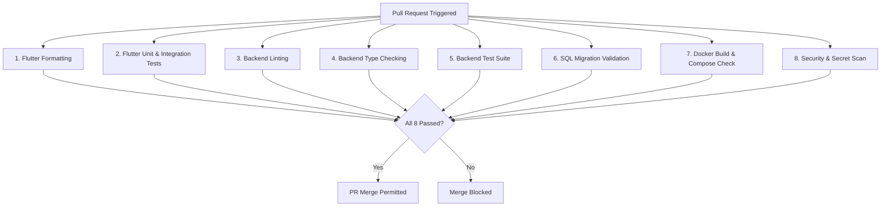

# ZankoAI Production GitHub CI/CD Pipeline Architecture

This document describes the Continuous Integration and Continuous Deployment (CI/CD) pipelines for **ZankoAI**, orchestrating the Flutter application, Express/TypeScript backend, and Supabase PostgreSQL migrations.

---

## 1. Repository Structure & Boundaries

```
zankoAI/
├── lib/               # Flutter mobile & web client application
├── test/              # Flutter unit, widget, and client integration tests
├── backend/           # Node.js 22 LTS / Express / TypeScript backend
│   ├── src/           # API controllers, middleware, and unified queues
│   ├── tests/         # Backend integration test suite
│   ├── Dockerfile     # Multi-stage production container
│   └── docker-compose.prod.yml # Production orchestration
├── supabase/
│   └── migrations/    # Monotonic SQL migration scripts
├── deploy/            # Shell provisioning, deployment, and rollback scripts
└── .github/
    └── workflows/     # GitHub Actions workflows (ci.yml, deploy-production.yml)
```

---

## 2. Branching Model

| Branch | Purpose | PR Target | Deployment Target | Protection Rules |
| :--- | :--- | :--- | :--- | :--- |
| **`feature/*`** | Isolated developer feature branches | -> `develop` | Local / Preview | None |
| **`develop`** | Integration branch for staging | -> `main` | Staging environment | Require CI checks to pass |
| **`main`** | **Production release branch** | N/A | **DigitalOcean Droplet (`api.zankoai.com`)** | **Strict Protection**: 1+ Approving reviews, All 8 CI checks must pass, linear history |

---

## 3. The 8 GitHub Actions CI Checks

The workflow [`.github/workflows/ci.yml`](file:///c:/dev/zankoAI/.github/workflows/ci.yml) enforces 8 automated quality gates before any code can merge into `develop` or `main`:



### Detailed Breakdown:
1. **Flutter Formatting**:
   - Command: `dart format --output=none --set-exit-if-changed lib/ test/`
   - Guarantees strict Dart formatting across the entire mobile and web codebase.
2. **Flutter Tests**:
   - Command: `flutter test --coverage`
   - Runs client test suites including contract validations, monitoring models, and disaster recovery simulations.
3. **Backend Lint**:
   - Command: `npm run lint` in `backend/`
   - Checks code style and syntax hygiene.
4. **Backend Type Checking**:
   - Command: `npm run typecheck` (`tsc --noEmit`) in `backend/`
   - Enforces strict TypeScript compile-time type safety with zero warnings.
5. **Backend Tests**:
   - Command: `npm test` in `backend/`
   - Executes the end-to-end backend test runner across security, storage, limits, and monitoring endpoints.
6. **SQL Migration Validation**:
   - Script: `scripts/validate_sql_migrations.sh`
   - Validates that every file in `supabase/migrations/` follows the `YYYYMMDDHHMMSS_name.sql` format, is monotonically ordered, and uses guarded `DROP ... IF EXISTS` clauses.
7. **Docker Build**:
   - Command: `docker buildx build backend/Dockerfile`
   - Verifies that the multi-stage Alpine runner compiles cleanly, caching layers via GitHub Actions cache.
   - Validates `backend/docker-compose.prod.yml` syntax.
8. **Security Checks**:
   - Tool: **TruffleHog OSS**
   - Scans commits and diffs for leaked passwords, JWT secrets, Supabase keys, or API tokens.
   - Runs `npm audit --audit-level=high` on backend dependencies.

---

## 4. Production Deployment Pipeline

Triggered automatically upon push to `main` via [`.github/workflows/deploy-production.yml`](file:///c:/dev/zankoAI/.github/workflows/deploy-production.yml):

1. **Gate**: Awaits successful completion of all 8 CI checks.
2. **SSH Connection**: Authenticates to DigitalOcean Droplet via `DO_SSH_PRIVATE_KEY` as non-root user `zanko_deploy`.
3. **Secret Injection**: Injects GitHub repository secrets into `/var/www/zankoAI/backend/.env.production` with strict `chmod 600` permissions.
4. **Rolling Update**: Executes `deploy/deploy.sh` to compile containers and start services without downtime.
5. **Live Health Verification**:
   - Probes `GET https://api.zankoai.com/api/health`
   - Probes `GET https://api.zankoai.com/api/ready`
   - Polls 6 times over 60 seconds.
6. **Automated Rollback**:
   - If health probes do not return HTTP 200, the workflow automatically executes `deploy/rollback_deployment.sh`, restoring the previous stable container build and notifying the team.
